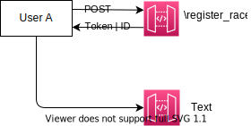

# Cose da fare

1. Gestire le utenze di caricamento non tramite register-login ma in modo "silent" (?) [Daniele controlla]
2. Aggiornare chiamata post con i parametri di consegna:
    - `race_name`: nome della gara
    - `race_date`: la data di svolgimento
    - `email`: la propria email.

    Response deve avere la chiave primaria del file + token (Che si ricollega al punto 1)

3. Schema: (I risultati parziali sono gli split times?)
 
 

4. Il punto 4 è già disponibile ma è da migliorare
5. Il punto 5 è già disponibile
6. Il punto 6 è un estensione del punto 5 (deve esserci la query sulla chiave primaria)
7. Va modificato il simulatore, per ora genera solo una classe per ogni evento, sarebbe consono far si che ne vengano generate di più. Il punto richiede che si possa richiedere anche solo i risultati di una classe per ogni evento in memoria
8. Dare la possibilità di scaricare l'xml (Li teniamo in memoria o li convertiamo e facciamo scaricare?)
9. Richiamo dei risultati di un determinato club nell'evento Z di categoria Y